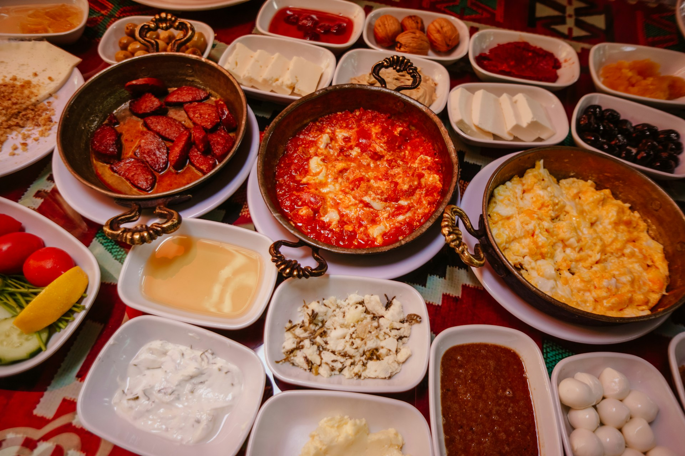

<div align="center">
  
  
  # 🛒 Deltizen Corner Website v2
  
  **Aplikasi Web Pemesanan Makanan & Minuman Berbasis Laravel**
  <br>
  *Solusi praktis transaksi restoran/kantin digital untuk mempermudah antrean pelanggan secara online.*
</div>

---

## 📖 Deskripsi Proyek
**Deltizen Corner Website v2** adalah sistem informasi Point of Sales (POS) dan e-commerce kuliner yang dirancang secara khusus untuk mengatur transaksi antara pelanggan dan pengelola (*Admin* & *Owner*). 
Aplikasi ini sudah dilengkapi dengan manajemen katalog produk, kategori makanan/minuman, sistem keranjang belanja (*cart*), proses checkout pesanan, manajemen order, dan laporan penjualan yang komprehensif.

## 🚀 Fitur Utama
- **Multi-Role Authentication**: Terbagi ke dalam akses untuk Pelanggan (Customer), Admin, dan Pemilik (Owner).
- **Katalog Produk Dinamis**: Menampilkan berbagai menu makanan, minuman, hidangan penutup, hingga paket kombo dengan gambar.
- **Sistem Keranjang & Checkout**: Memudahkan pelanggan saat meninjau dan menyelesaikan pesanan.
- **Sistem Manajemen Order**: Konfirmasi pesanan dan pencetakan faktur (*invoice*).
- **Laporan Penjualan (PDF/Print)**: Rekap pendapatan harian/bulanan khusus bagi role Owner.
- **Dashboard Statistik interaktif** untuk melacak penjualan.

## 🛠️ Teknologi yang Digunakan
- **Backend**: Laravel 8 (PHP)
- **Frontend**: HTML5, CSS3 (Bootstrap/Sass), JavaScript & Vue.js (opsional/komponen)
- **Database**: MySQL
- **Library Terintegrasi**: 
  - `barryvdh/laravel-dompdf` (Cetak Laporan Penjualan/Invoice)
  - `darryldecode/cart` (Manajemen Sistem Cart)

## ⚙️ Panduan Instalasi (Development)

### Persyaratan Minimum
- PHP >= 7.3 atau 8.0
- Composer Dependencies Manager
- Node.js & NPM
- MySQL / MariaDB (via XAMPP / Laragon / Sail)

### Langkah Konfigurasi
1. **Clone repository ini:**
   ```bash
   git clone https://github.com/reinaldyhutapea/Deltizen-Corner-Website-v2.git
   cd Deltizen-Corner-Website-v2
   ```

2. **Install modul PHP & Frontend:**
   ```bash
   composer install
   npm install
   npm run dev
   ```

3. **Atur konfigurasi *Environment*:**
   Salin file `.env.example` menjadi `.env`:
   ```bash
   cp .env.example .env
   ```
   Lalu, isi konfigurasi database *MySQL* di file `.env` yang baru:
   ```env
   DB_DATABASE=nama_database_anda
   DB_USERNAME=root
   DB_PASSWORD=
   ```

4. **Generate Application Key:**
   ```bash
   php artisan key:generate
   ```

5. **Jalankan Migrasi Database:**
   ```bash
   php artisan migrate
   ```
   *(Opsional: Jalankan `php artisan db:seed` apabila ada data awal).*

6. **Jalankan local server:**
   ```bash
   php artisan serve
   ```
   Akses project melalui *browser* di [http://127.0.0.1:8000](http://127.0.0.1:8000).

---

## 👥 Kontributor
Proyek ini dikembangkan oleh:
- **12S22010** - Reinaldy Hutapea ([@reinaldyhutapea](https://github.com/reinaldyhutapea))
- **12S22008** - Rahel Simanjuntak
- **12S22017** - Lenna Febriana
- **12S22051** - Sefanya Y Sinaga
